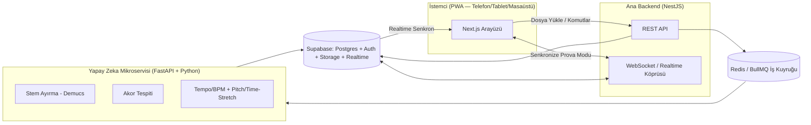

# Woodshed AI — Müzisyenler İçin Yapay Zeka Destekli Ses Ayırma & Pratik Platformu

**Belge türü:** Ürün Gereksinim Dokümanı (PRD) + 10 Aşamalı Yapım Planı + Ajan Görev Tanımları
**Kod adı:** Woodshed AI *(yer tutucu isim — "woodshedding", müzisyenlerin yoğun pratik yapma pratiğine verilen isimdir; proje sahibi dilediği zaman değiştirebilir)*
**Versiyon:** 1.0
**Tarih:** 2026-08-22

---

## 0. Bu Belge Nasıl Kullanılır

Bu belge, projeyi devralacak **orkestratör yapay zeka sistemine** (ör. Anthropic tarafından koordine edilen bir ajan ekibi) yöneliktir. Orkestratör:

1. Önce **Bölüm 6 (Genel Kurallar)**'ı tüm alt ajanlara zorunlu ortak standart olarak uygular.
2. **Bölüm 7**'deki 10 aşamayı, belirtilen bağımlılık sırasına göre 10 farklı ajana dağıtır (bazı aşamalar birbirine bağımlı olmadığı için paralel yürütülebilir — bağımlılıklar her aşamanın altında açıkça belirtilmiştir).
3. Bu 10 ajana **ek olarak**, kendi inisiyatifiyle **Bölüm 8**'de tanımlanan 2 ekstra kalite-güvence ajanını (Ajan 11 – Bug Avcısı, Ajan 12 – Güvenlik Denetçisi) oluşturur ve orada tarif edilen tetikleyicilere göre sürekli çalıştırır.
4. Her aşamanın sonunda **Definition of Done (Bitti Sayılma Kriteri)** karşılanmadan bir sonraki ajana devredilmez.

### Bu belgede alınan varsayımlar

Kullanıcı özellik listesini verirken platform/teknoloji tercihi belirtmedi. Aşağıdaki varsayımlar "tamamen ücretsiz build edilebilir olsun" hedefine göre seçilmiştir; proje sahibi bunlardan herhangi birini değiştirmek isterse bu belge revize edilebilir:

- **Platform:** Native iOS/Android yerine **tek kod tabanlı, responsive bir PWA (Progressive Web App)**. Bu sayede "telefon, tablet, masaüstü" erişimi tek bir web uygulamasıyla (ana ekrana eklenebilir, çevrimdışı çalışabilir) sağlanır — 3 ayrı native uygulama geliştirme maliyetinden kaçınılır. Talep olursa ileride React Native ile mobil sarmalayıcıya (wrapper) geçilebilir.
- **Bütçe:** Tüm teknoloji seçimleri ücretsiz katman (free tier) veya açık kaynak lisanslı araçlardan seçildi. **Önemli:** Yapay zeka ses işleme (özellikle stem ayırma) hesaplama açısından ağırdır; "sonsuza kadar sınırsız ücretsiz" gerçekçi değildir — bkz. Bölüm 9 "Riskler".
- **Dil:** Arayüz Türkçe + İngilizce (i18n) olarak planlanmıştır.

---

## 1. Vizyon

Müzisyenlerin herhangi bir şarkıyı (ses veya video dosyası) yükleyip saniyeler içinde vokal, davul, bas, gitar ve piyano kanallarına ayırabildiği; şarkının akorlarını, temposunu ve tonunu yapay zeka ile otomatik çözümleyip pratik, prova ve sahne performansı için kullanılabilir hale getiren; çoklu cihazdan senkronize erişilebilen, tamamen ücretsiz ve açık kaynak bileşenler üzerine kurulu bir web platformu.

## 2. Hedef Kullanıcı

Enstrüman çalan/öğrenen müzisyenler (gitar, bas, piyano, davul, vokal), müzik öğretmenleri ve öğrencileri, cover/tribute grupları, sahne öncesi prova yapan gruplar ve solo müzisyenler.

## 3. Temel Özellikler (Kaynak Gereksinim Listesi)

Aşağıdaki 8 özellik, projenin değişmez gereksinim kaynağıdır. Her ajan kendi aşamasında hangi özelliğe hizmet ettiğini bu listeye referansla takip etmelidir.

| # | Özellik | Kısa Açıklama |
|---|---|---|
| 1 | Yapay Zeka Destekli Parça Ayırma (Stem Separation) | Ses/video dosyasını vokal, davul, bas, gitar (elektro/akustik), piyano kanallarına ayırma; her kanalı ayrı ayrı sesip/kısma |
| 2 | Akıllı Akor Tespiti | Şarkıdaki akorları otomatik, gerçek zamanlı analiz edip ekranda anlık takip |
| 3 | Tempo ve Akıllı Metronom | Orijinal BPM'i algılama, kalite kaybı olmadan hızlandırma/yavaşlatma, senkronize metronom |
| 4 | Ton (Key) Değiştirme / Transpoze | Yarım ses aralıklarla ton kaydırma, kalite kaybı olmadan |
| 5 | Akıllı Loop (Döngü) | Belirli bir bölümü seçip sürekli tekrar ettirme |
| 6 | Geri Sayım (Count-in) | Özelleştirilebilir hazırlık geri sayımı |
| 7 | Çalma Listeleri ve Bulut Senkronizasyonu | Proje/playlist organizasyonu, cihazlar arası senkron erişim |
| 8 | Senkronize Prova Modu (Ortak Görüntüleme) | Aynı hesaba bağlı farklı cihazlardaki kullanıcılar, açılan şarkının akor akışını gerçek zamanlı ve senkronize şekilde (ekran paylaşımı gibi) görür |

---

## 4. Teknoloji Yığını

| Katman | Teknoloji | Not / Lisans |
|---|---|---|
| Frontend / PWA | Next.js (React + TypeScript), Tailwind CSS, `next-pwa` / Workbox | MIT lisanslı; tek kod tabanı ile tüm cihazlar |
| Ana Backend API | Node.js + NestJS (TypeScript) | REST + WebSocket; iş mantığı ve yetkilendirme |
| Yapay Zeka Mikroservisi | Python + FastAPI | Stem ayırma, akor/tempo/pitch işlemleri; ağır işlemler ana API'den izole edilir |
| Veritabanı + Auth + Depolama + Realtime | Supabase (ücretsiz tier: Postgres, Auth, Storage, Realtime, Row Level Security) | Özellik 7 (senkron) ve Özellik 8 (ortak görüntüleme) için Realtime kanalları doğrudan kullanılabilir |
| İş Kuyruğu | Redis (Upstash ücretsiz tier) + BullMQ | Ayırma/analiz işleri uzun sürdüğü için zorunlu asenkron kuyruk |
| Stem Ayırma Modeli | **Demucs** (`htdemucs` / `htdemucs_6s`, Meta AI, MIT lisans, açık kaynak) | 6 kanala kadar ayırma (vokal, davul, bas, gitar, piyano, diğer) |
| Akor Tespiti | `librosa` (chroma özellik çıkarımı, MIT/ISC benzeri) + açık kaynak CNN/HMM tabanlı akor tanıma modeli (ör. akademik "Chord-CNN-CRF" tipi modeller) | Kullanılacak spesifik modelin lisansı Ajan 5 tarafından build öncesi doğrulanmalı |
| Tempo/BPM Tespiti | `librosa` beat-tracking | Açık kaynak, ücretsiz |
| Ton Değiştirme / Zaman Uzatma (kalite kaybı olmadan) | **SoundTouch** (LGPL) veya kendi WSOLA/Phase-Vocoder implementasyonu | Rubber Band Library GPL/ticari çift lisanslıdır — kapalı kaynaklı ticari kullanımda risklidir; bu yüzden SoundTouch (LGPL) tercih edilmelidir |
| Ses/Video Format Dönüştürme | FFmpeg (LGPL build) | Giriş formatlarını normalize etmek için |
| Hosting (MVP, ücretsiz) | Vercel (frontend), Render/Fly.io/Hugging Face Spaces (AI servisi, ücretsiz CPU), Supabase, Upstash | Bkz. Bölüm 9 — ölçeklendikçe GPU maliyeti kaçınılmaz |
| CI/CD | GitHub Actions (ücretsiz tier) | Her PR'da otomatik build/lint/test |

---

## 5. Sistem Mimarisi (Genel Bakış)



**Akış özeti:** Kullanıcı dosya yükler → dosya Supabase Storage'a gider → iş kuyruğuna görev eklenir → AI mikroservisi (Demucs + akor/tempo analizleri) işi alır, sonuçları (stem dosyaları + akor JSON + BPM) üretir → sonuçlar veritabanına yazılır → istemci Realtime kanalı üzerinden sonucu anında alır → Senkronize Prova Modu'nda aynı oturuma bağlı diğer cihazlar da aynı akor/oynatma durumunu WebSocket/Realtime üzerinden anlık görür.

---

## 6. Genel Kurallar (TÜM Ajanlar İçin Zorunlu)

Aşağıdaki kurallar, 10 yapım ajanının + 2 kalite ajanının **tamamı** için bağlayıcıdır. Her ajan çalışmaya başlamadan önce bu bölümü okumuş kabul edilir.

### 6.1 Repo ve Klasör Yapısı (Monorepo)

```
/apps
  /web            → Next.js PWA (frontend)
  /api            → NestJS ana backend
  /ai-service     → FastAPI yapay zeka mikroservisi
/packages
  /shared-types   → Ortak TypeScript tip tanımları / API sözleşmeleri
  /ui             → Paylaşılan UI bileşenleri
/docs
  /handoffs       → Her ajanın devir dokümanı (bkz. 6.3)
  /bug-reports    → Ajan 11 çıktıları
  /security       → Ajan 12 çıktıları
/infra            → CI/CD, deployment config
```

### 6.2 Git ve Kod Standartları

- Dallanma: `stage-01-infra`, `stage-02-auth`, … `stage-10-integration` formatında branch isimlendirmesi.
- Commit mesajları: [Conventional Commits](https://www.conventionalcommits.org/) formatı (`feat:`, `fix:`, `chore:`, vb.).
- Her PR, ilgili aşamanın Definition of Done kriterlerine referans vermelidir.
- Lint/format: ESLint + Prettier (TS/JS tarafı), Black + Ruff (Python tarafı). CI bunları otomatik kontrol eder.
- **Hiçbir ajan bir önceki ajanın kodunu onayı olmadan geriye dönük kırmamalıdır**; kırılma gerekiyorsa `/docs/handoffs` içine gerekçe yazılır.

### 6.3 Ajanlar Arası Devir Protokolü (Handoff)

Her ajan, aşamasını bitirdiğinde `/docs/handoffs/stage-XX.md` dosyasına şunları yazmak zorundadır:

- Ne inşa edildi (özellik/modül listesi)
- Ortaya çıkan API uç noktaları / fonksiyon imzaları / veri şemaları
- Gerekli ortam değişkenleri (isim + açıklama, **değer değil**)
- Yerelde nasıl çalıştırılır / test edilir
- Bilinen sınırlamalar, TODO'lar, bir sonraki ajana notlar

Bu, ajanların birbirini "hatırlamadan" (her biri farklı bir oturumda/ajanda çalıştığı için) sorunsuz devralabilmesini sağlar.

### 6.4 Test ve Kalite Eşiği

- Yeni yazılan her modül için birim test zorunludur (minimum kabul edilebilir kapsama: kritik iş mantığı için ~%70).
- Her aşama, kendi Definition of Done'ında belirtilen entegrasyon/uçtan uca testleri geçmeden "tamamlandı" sayılamaz.
- **Ajan 11 (Bug Avcısı)** her kod değişikliğinden sonra otomatik devreye girer (bkz. Bölüm 8.1) — kritik/yüksek önem dereceli hata varsa merge engellenir.

### 6.5 Gizlilik, Sır Yönetimi ve Ortam Değişkenleri

- API anahtarları, veritabanı şifreleri vb. **asla** koda gömülmez; `.env` + platform sır yöneticisi (Vercel/Render/Supabase secret store) kullanılır.
- `.env.example` dosyası her uygulama kökünde bulunur, gerçek değer içermez.

### 6.6 Telif Hakkı ve Yasal Not (Tüm Ajanlar Dikkate Almalı)

Uygulama kullanıcıların yükledikleri şarkıları işleyecektir. Kullanım Şartları'nda şu ilkeler net biçimde yer almalıdır: kullanıcı yalnızca **haklarına sahip olduğu veya kullanım izni olan** içerikleri yükleyebilir; platform bu içerikleri **kişisel pratik/eğitim amacıyla** işler, yeniden dağıtım (redistribution) veya ticari kullanım için değildir; ayrılan stem'ler platform dışında paylaşılamaz şeklinde bir kullanıcı sözleşmesi maddesi gerekir. Bu, Ajan 2 (Auth/Kullanıcı) ve Ajan 12 (Güvenlik) aşamalarında somutlaştırılmalıdır.

### 6.7 Erişilebilirlik ve Uluslararasılaştırma (i18n)

- Arayüz TR/EN dil desteğiyle kurulmalı (`next-intl` veya benzeri).
- Temel WCAG AA erişilebilirlik kriterleri (kontrast, klavye navigasyonu, ekran okuyucu etiketleri) gözetilmelidir — özellikle mixer/waveform gibi görsel yoğun bileşenlerde alternatif metin/etiketleme önemlidir.

---

## 7. Faz Planı — 10 Yapım Aşaması (10 Ajan)

> Bağımlılık notasyonu: "Bağımlı olduğu aşama(lar)" belirtilmeyen aşamalar diğerleriyle paralel başlatılabilir.

### 🧩 Ajan 1 — Proje Altyapısı ve DevOps
**Bağımlılık:** Yok (ilk başlayan ajan)

**Yapılacaklar:**
- Monorepo iskeletini kur (Bölüm 6.1'deki yapı), paket yöneticisi (pnpm workspaces) yapılandır.
- Next.js (web), NestJS (api), FastAPI (ai-service) proje iskeletlerini oluştur.
- ESLint/Prettier/Black/Ruff, pre-commit hook'ları (lint-staged/husky) kur.
- GitHub Actions CI pipeline: her PR'da lint + test + build çalıştır.
- Supabase projesini oluştur (Auth, Postgres, Storage, Realtime aktif); Upstash Redis'i bağla.
- Vercel (web) ve Render/Fly.io/HF Spaces (ai-service) için ücretsiz deployment pipeline kur.
- `.env.example` dosyalarını ve gizli değişken listesini hazırla.
- Temel `README.md` ve `/docs` klasör iskeletini oluştur.

**Teslimatlar:** Çalışan boş iskelet uygulamalar (hepsi "Hello World" seviyesinde ama build/deploy oluyor), CI yeşil, `/docs/handoffs/stage-01.md`.

**Definition of Done:** `main` branch'e push edildiğinde tüm 3 uygulama (web/api/ai-service) otomatik build olup ücretsiz hosting ortamlarına deploy oluyor; CI pipeline lint+test+build adımlarını yeşil geçiyor.

---

### 🔐 Ajan 2 — Kimlik Doğrulama ve Kullanıcı Yönetimi
**Bağımlılık:** Ajan 1

**Yapılacaklar:**
- Supabase Auth ile e-posta/şifre + Google OAuth girişini entegre et.
- Kullanıcı profil şeması: ad, e-posta, enstrüman tercihi, plan/rol alanı (ileride gerekirse).
- Oturum yönetimi (JWT/refresh token), "şifremi unuttum" akışı.
- Hesap ayarları sayfası (profil düzenleme, hesap silme — KVKK/GDPR "unutulma hakkı" gereği zorunlu).
- Row Level Security (RLS) politikalarını Postgres tablolarında kur: her kullanıcı yalnızca kendi verisini okuyup yazabilsin.
- Kullanım Şartları / Gizlilik Politikası sayfası taslağı (Bölüm 6.6'daki telif maddeleri dahil).

**Teslimatlar:** Çalışan kayıt/giriş/çıkış akışı, korumalı route'lar, RLS politikaları, `/docs/handoffs/stage-02.md`.

**Definition of Done:** Yeni kullanıcı kayıt olup giriş yapabiliyor; başka bir kullanıcının verisine RLS sayesinde erişilemediği testlerle kanıtlanıyor; oturum süresi dolunca doğru şekilde yeniden giriş isteniyor.

---

### 📤 Ajan 3 — Dosya Yükleme ve İş Kuyruğu Altyapısı
**Bağımlılık:** Ajan 1, Ajan 2

**Yapılacaklar:**
- Ses/video dosyası yükleme uç noktası (chunked/resumable upload — büyük dosyalar için).
- Dosya doğrulama: izin verilen formatlar (mp3, wav, m4a, mp4, vb.), maksimum boyut/süre sınırı, MIME-type doğrulama (sadece uzantıya güvenme — güvenlik açısından kritik, Ajan 12 bunu tekrar denetleyecek).
- Yüklenen dosyayı Supabase Storage'a kaydet, meta veriyi (proje/parça kaydı) Postgres'e yaz.
- FFmpeg ile format normalizasyonu (örn. her şeyi standart WAV/PCM'e çevirme) yapan bir ön-işleme adımı.
- BullMQ ile "işleme kuyruğu" oluştur: yükleme tamamlanınca otomatik olarak bir "stem-separation-job" kuyruğa eklensin.
- İş durumu takibi: `pending / processing / done / failed` durumları ve istemciye gerçek zamanlı ilerleme bildirimi (Supabase Realtime veya WebSocket ile).

**Teslimatlar:** Uçtan uca çalışan "dosya yükle → kuyruğa iş düştü" akışı, `/docs/handoffs/stage-03.md`.

**Definition of Done:** Bir kullanıcı dosya yükleyebiliyor, dosya doğrulanıp depolanıyor, kuyruğa iş ekleniyor ve istemci iş durumunu gerçek zamanlı görebiliyor (henüz gerçek AI işlemesi olmasa da sahte/iskelet worker ile uçtan uca test edilmiş olmalı).

---

### 🎚️ Ajan 4 — Yapay Zeka Ses Ayırma Motoru (Stem Separation)
**Bağımlılık:** Ajan 3

**Yapılacaklar:**
- FastAPI servisine Demucs (`htdemucs_6s` modeli) entegrasyonu: vokal, davul, bas, gitar, piyano, diğer olmak üzere 6 kanal çıktı.
- BullMQ worker'ının bu servisi çağırmasını sağla (kuyruktaki iş → AI servisine istek → sonuç dosyaları Storage'a yükle → iş durumu "done" yap).
- Kaynak yönetimi: aynı anda işlenebilecek maksimum iş sayısını sınırla (ücretsiz/CPU altyapıda kaynak taşmasını önlemek için — aynı zamanda maliyet/performans risk notuna bkz. Bölüm 9).
- Kullanıcı arayüzüne API: "sadece vokal", "vokalsiz (karaoke)", "tek enstrüman soло" gibi hazır kanal kombinasyonlarını dönebilen bir endpoint.
- Hata durumlarını (bozuk dosya, işlem zaman aşımı) yönetip kullanıcıya anlamlı hata mesajı döndürme.

**Teslimatlar:** Yüklenen bir şarkının gerçekten 6 stem'e ayrıldığı, dosyaların indirilebilir/oynatılabilir olduğu çalışan sistem, `/docs/handoffs/stage-04.md`.

**Definition of Done:** En az 5 farklı test şarkısıyla ayırma kalitesi manuel dinlenerek doğrulanmış; ayırma süresi ve kaynak kullanımı ölçülüp dokümante edilmiş; hata senaryoları (bozuk/desteklenmeyen dosya) düzgün mesajla sonuçlanıyor.

---

### 🎼 Ajan 5 — Akıllı Akor Tespiti Motoru
**Bağımlılık:** Ajan 3 (Ajan 4 ile paralel yürütülebilir — ikisi de ham/normalize edilmiş sesi girdi olarak kullanır)

**Yapılacaklar:**
- `librosa` ile kroma (chroma) özellik çıkarımı; akor tanıma modelini araştır/seç (açık kaynak lisans uyumluluğu **build öncesi doğrulanmalı** — bkz. Bölüm 9.2).
- Zaman damgalı akor dizisi üret: `[{start: 0.0, end: 2.3, chord: "Am"}, ...]` formatında JSON çıktısı.
- Akor tespiti sonucunu veritabanına kaydet, oynatma pozisyonuyla senkronize edilebilecek şekilde sun.
- Tespit doğruluğunu artırmak için post-processing (ör. çok kısa/gürültülü akor geçişlerini filtreleme, en yaygın akor kalıplarına ağırlık verme).
- (Opsiyonel/ileri seviye) Gitar/piyano için akor diyagramı/parmak pozisyonu gösterimi.

**Teslimatlar:** Bir şarkı için doğru zaman damgalı akor JSON'ı üreten çalışan servis, `/docs/handoffs/stage-05.md`.

**Definition of Done:** En az 5 test şarkısında üretilen akor dizisi bilinen doğru akorlarla (manuel referansla) karşılaştırılıp kabul edilebilir doğrulukta (ör. büyük çoğunlukla temel akor - major/minor - doğru) olduğu gösterilmiş.

---

### ⏱️ Ajan 6 — Tempo/Metronom ve Ton Değiştirme Ses İşleme Motoru
**Bağımlılık:** Ajan 3 (Ajan 4/5 ile paralel yürütülebilir)

**Yapılacaklar:**
- `librosa` beat-tracking ile otomatik BPM tespiti.
- SoundTouch (veya kendi WSOLA/Phase-Vocoder implementasyonu) ile **kalite kaybı olmadan** zaman uzatma/kısaltma (time-stretch) entegrasyonu — hız değişse de ton sabit kalmalı.
- Aynı motorla **pitch-shift** (ton değiştirme) desteği — yarım ses (semitone) hassasiyetinde yukarı/aşağı transpoze, hız sabit kalmalı.
- Tespit edilen BPM'e senkronize metronom ses üretici (tık sesi, vurgu farkı olan/olmayan) — kullanıcı özelleştirebilsin (ses, vurgu deseni).
- Bu üç özelliğin (tempo, ton, metronom) gerçek zamanlı/near-real-time önizleme ile çalışabilmesi için performans optimizasyonu.

**Teslimatlar:** Bir parçanın hızını/tonunu kalite kaybı hissedilmeden değiştirebilen ve doğru BPM'e kilitli metronom üreten çalışan modül, `/docs/handoffs/stage-06.md`.

**Definition of Done:** A/B dinleme testinde ton/hız değişikliği sonrası ses kalitesinde belirgin bozulma olmadığı doğrulanmış; metronom, tespit edilen BPM ile ±1 BPM hassasiyetinde senkronize.

---

### 🎧 Ajan 7 — Web/PWA Oynatıcı Arayüzü (Multi-Track Player)
**Bağımlılık:** Ajan 4, Ajan 5, Ajan 6

**Yapılacaklar:**
- Çoklu kanal mixer arayüzü: her stem için ses seviyesi, mute/solo kontrolü.
- Waveform görselleştirmesi (ör. `wavesurfer.js` veya benzeri açık kaynak kütüphane).
- Akor akışının oynatma pozisyonuyla senkronize, ekranda anlık gösterimi (Özellik 2).
- Loop/döngü bölge seçici: waveform üzerinde başlangıç/bitiş noktası sürükleyerek seçme, sürekli tekrar oynatma (Özellik 5).
- Count-in (geri sayım) ayarları: süre/vuruş sayısı özelleştirme, sesli geri sayım (Özellik 6).
- Tempo/ton/metronom kontrollerinin arayüze bağlanması (Ajan 6 çıktısı).
- Tamamen responsive tasarım: telefon, tablet, masaüstü ekran boyutlarında test edilmiş; PWA "ana ekrana ekle" ve temel çevrimdışı destek (service worker ile son işlenmiş stem'lerin önbelleklenmesi).

**Teslimatlar:** Bir şarkıyı yükleyip ayrıştırılmış kanalları mix edebilen, akorları görebilen, loop/count-in kullanabilen tam işlevsel oynatıcı arayüz, `/docs/handoffs/stage-07.md`.

**Definition of Done:** Özellik 1, 2, 3, 4, 5, 6'nın tamamı gerçek bir şarkı üzerinden uçtan uca, üç farklı ekran boyutunda (telefon/tablet/masaüstü emülasyonu) manuel olarak test edilip çalıştığı gösterilmiş.

---

### 📁 Ajan 8 — Çalma Listeleri, Proje Yönetimi ve Bulut Senkronizasyonu
**Bağımlılık:** Ajan 2, Ajan 7

**Yapılacaklar:**
- Playlist/proje CRUD işlemleri (oluştur, düzenle, sil, parça ekle/çıkar, sırala).
- Arama ve filtreleme (parça adı, sanatçı, etiket).
- Supabase Realtime/Postgres senkronizasyonu ile aynı hesaptaki farklı cihazlar arasında playlist ve proje durumunun anlık senkronize olması (Özellik 7).
- PWA service worker ile temel çevrimdışı erişim: son açılan projelerin/stemlerin cihazda önbelleklenmesi.
- Depolama kotası/yönetimi: kullanıcı başına dosya boyutu sınırları (ücretsiz altyapı maliyetini kontrol altında tutmak için — bkz. Bölüm 9).

**Teslimatlar:** Kullanıcının projelerini organize edip iki farklı cihazda (ör. telefon + masaüstü tarayıcı) aynı listeyi anlık gördüğü çalışan sistem, `/docs/handoffs/stage-08.md`.

**Definition of Done:** Bir cihazda playlist'e parça eklendiğinde, aynı hesapla giriş yapılmış başka bir cihazda sayfa yenilenmeden (Realtime ile) görünür hale geldiği kanıtlanmış.

---

### 📡 Ajan 9 — Senkronize Prova Modu (Gerçek Zamanlı Ortak Görüntüleme)
**Bağımlılık:** Ajan 7, Ajan 8

**Yapılacaklar:**
- Aynı hesapla giriş yapmış birden fazla cihaz/oturum için "oturum" (session) kavramı: biri şarkıyı açtığında diğerleri otomatik olarak aynı şarkının akor akışını ve oynatma konumunu (play/pause/seek) gerçek zamanlı görsün (Özellik 8).
- Supabase Realtime Presence/Broadcast kanalları veya WebSocket (Socket.io) ile durum yayını: `{trackId, position, isPlaying, currentChordIndex}` gibi bir state'in düşük gecikmeyle senkronize edilmesi.
- Yetkilendirme: yalnızca **aynı hesaba ait, oturum açmış cihazlar** bu yayını görebilmeli (başka kullanıcıların oturumuna asla erişilememeli — bu madde Ajan 12 tarafından ayrıca denetlenecek).
- "Lider/takipçi" (host/follower) modeli: hangi cihazın oynatma kontrolüne sahip olduğu, diğerlerinin salt-izleyici modda olduğu net tanımlanmalı.
- Bağlantı kopması/yeniden bağlanma senaryolarının zarifçe yönetilmesi (state kaybı olmadan).

**Teslimatlar:** İki farklı cihazda aynı hesapla giriş yapıldığında, birinde başlatılan şarkının akor akışının diğerinde gerçek zamanlı göründüğü çalışan özellik, `/docs/handoffs/stage-09.md`.

**Definition of Done:** İki gerçek/emüle cihazla manuel test: cihaz A'da şarkı oynatılıp duraklatıldığında, cihaz B'de akor gösterimi ve oynatma durumu 1 saniyeden kısa gecikmeyle senkronize oluyor; yetkisiz bir hesabın bu oturuma erişemediği doğrulanmış.

---

### 🚀 Ajan 10 — Entegrasyon, Uçtan Uca Test, Performans ve Lansman Hazırlığı
**Bağımlılık:** Ajan 1–9 (tamamı)

**Yapılacaklar:**
- Tüm modüllerin (1-9) uçtan uca entegrasyon testi: kayıt ol → dosya yükle → ayırma/akor/tempo işlensin → oynatıcıda kullan → playlist'e ekle → başka cihazdan senkron gör.
- Performans optimizasyonu: AI iş kuyruğu darboğazlarının giderilmesi, sayfa yükleme hızı (Lighthouse skorları), gereksiz API çağrılarının azaltılması.
- Yük testi (ör. `k6` veya `Artillery` ile) — özellikle iş kuyruğu ve AI servisinin eş zamanlı istek altında davranışı.
- İzleme/loglama kurulumu: hata takibi (ör. Sentry ücretsiz tier), temel metrikler (işlem süresi, hata oranı, kuyruk uzunluğu).
- Ücretsiz hosting ortamlarına final deployment, ortam değişkenlerinin production'da doğrulanması.
- Kullanıcıya yönelik onboarding akışı ve temel yardım/SSS sayfası.
- **Bu aşamanın tamamlanması, Ajan 12 (Güvenlik Denetçisi)'nin devreye girmesi için tetikleyicidir** (bkz. Bölüm 8.2).

**Teslimatlar:** Production'da erişilebilir, tüm 8 özelliğin uçtan uca çalıştığı, izlenen ve yük testinden geçmiş sistem, `/docs/handoffs/stage-10.md`.

**Definition of Done:** Tüm 8 özellik gerçek kullanıcı senaryosunda (yeni hesap oluşturarak) baştan sona test edilmiş; Lighthouse performans skoru kabul edilebilir seviyede (≥80 mobilde); hata izleme aktif; yük testi raporu dokümante edilmiş.

---

## 8. Kalite Güvence Ajanları (Orkestratörün Kendi Oluşturacağı 2 Ek Ajan)

Yukarıdaki 10 yapım ajanına **ek olarak**, orkestratör sistem kendi inisiyatifiyle aşağıdaki 2 ajanı oluşturup sürekli/otomatik şekilde çalıştırmalıdır. Bunlar yeni özellik **yazmaz**, yalnızca kalite ve güvenliği denetler.

### 🐛 Ajan 11 — Bug Avcısı (Continuous Bug Hunter)

**Tetikleyici:** Ajan 1-10'dan **herhangi biri tarafından yapılan her kod değişikliği/commit/PR sonrasında** otomatik olarak devreye girer. Sürekli/kesintisiz çalışır, tek seferlik değildir.

**Sorumluluklar:**
- Değişen kodun build'inin başarılı olduğunu doğrula (`npm run build` / `pip` bağımlılık kontrolü vb.).
- Statik analiz çalıştır: ESLint/TypeScript tip kontrolü, Python tarafında `ruff`/`mypy`.
- İlgili birim ve entegrasyon testlerini çalıştır; yeni eklenen kodun karşılık gelen testi olup olmadığını kontrol et.
- Runtime "duman testi" (smoke test) yap: temel akışın (ör. dosya yükleme, oynatma) hâlâ çalıştığını doğrula.
- Ses işleme koduna özgü riskleri kontrol et: bellek sızıntıları (büyük ses buffer'larının serbest bırakılmaması), yakalanmamış promise reddi/exception'lar, worker/kuyruk deadlock riskleri.
- Kodun Bölüm 6'daki genel kurallara (klasör yapısı, commit formatı, sır yönetimi) uyup uymadığını kontrol et — özellikle **yanlışlıkla commit edilmiş sır/API anahtarı** taraması (bu, Ajan 12'nin derinlemesine güvenlik denetiminden bağımsız, her commit'te yapılan hızlı bir ön kontroldür).
- Çözülmemiş `TODO`/`FIXME` yorumlarını ve API sözleşmesi (shared-types) uyumsuzluklarını işaretle.

**Çıktı formatı:** Her taramadan sonra `/docs/bug-reports/stage-XX-<tarih>.md` içine yapılandırılmış rapor:

```
Önem: Kritik / Yüksek / Orta / Düşük
Konum: dosya:satır
Açıklama: ...
Önerilen Düzeltme: ...
Durum: Açık / Düzeltildi / Doğrulandı
```

**Engelleme kuralı:** Kritik veya Yüksek önemde bulgu varsa, ilgili PR **merge edilemez**; sorumlu ajan düzeltip tekrar Ajan 11'e sunmak zorundadır. Ajan 11, düzeltme sonrası aynı bulguyu tekrar test edip "Doğrulandı" olarak kapatır.

### 🔒 Ajan 12 — Güvenlik Denetçisi (Security Auditor)

**Tetikleyici:** Birincil olarak **Ajan 10 (tam entegrasyon) tamamlandıktan sonra**, sistemin tamamı üzerinde kapsamlı bir denetim yapar. Ek olarak, Auth (Ajan 2), Dosya Yükleme (Ajan 3) ve Senkronize Prova Modu (Ajan 9) gibi yüksek riskli aşamalar tamamlandığında **erken/ara bir güvenlik ön-taraması** yapması önerilir (kritik bulgular geç fark edilirse maliyeti çok artar).

**Sorumluluklar (Final/Kapsamlı Denetim):**
- **OWASP Top 10** temelli tam denetim: enjeksiyon (SQL/NoSQL), kırık kimlik doğrulama, hassas veri ifşası, kırık erişim kontrolü, güvenlik yanlış yapılandırması, XSS, güvensiz deserileştirme, bilinen açıklı bağımlılıklar, yetersiz loglama/izleme.
- Bağımlılık güvenlik taraması: `npm audit`, `pip-audit` / OSV-Scanner ile bilinen CVE'lerin tespiti.
- **Dosya yükleme güvenliği** (kritik — kullanıcılar keyfi ses/video dosyası yüklüyor): MIME-type sahteciliği, path traversal, aşırı büyük dosya ile servis dışı bırakma (DoS) riski, dosya içeriği doğrulama.
- **Kimlik doğrulama/oturum güvenliği:** JWT işleme, şifre hash'leme (bcrypt/argon2), OAuth token saklama, oturum sabitleme (session fixation) kontrolü.
- **Row Level Security (RLS) denetimi:** Supabase politikalarının gerçekten her kullanıcıyı yalnızca kendi verisine hapsettiğinin testlerle kanıtlanması.
- **Senkronize Prova Modu (Özellik 8) özel denetimi:** Bir kullanıcının başka bir kullanıcının oturumuna/akor yayınına yetkisiz erişip erişemediğinin agresif şekilde test edilmesi (bu özellik doğası gereği "gerçek zamanlı yayın" olduğu için yanlış yapılandırılırsa veri sızıntısı riski yüksektir).
- **API kötüye kullanım/oran sınırlama (rate limiting):** AI işleme maliyetli olduğu için, kötü niyetli/otomatik aşırı istek gönderiminin hem güvenlik hem **maliyet kontrolü** açısından engellendiğinin doğrulanması.
- **Sır/ortam değişkeni denetimi:** Repo geçmişinde sızmış sır olup olmadığının taranması (`gitleaks` veya benzeri), production sır yönetiminin doğru yapılandırıldığının kontrolü.
- **CORS ve API erişim politikası** gözden geçirmesi.
- **Veri gizliliği/uyumluluk:** KVKK (Türkiye) ve ilgiliyse GDPR açısından; kullanıcı verisi silme ("unutulma") hakkının gerçekten çalıştığının, yüklenen ses dosyalarının makul sürede/istekle silinebildiğinin doğrulanması.

**Çıktı formatı:** `/docs/security/audit-report-<tarih>.md` içinde, her bulgu için önem derecesi (Kritik/Yüksek/Orta/Düşük — CVSS benzeri), etkilenen bileşen, kanıt/tekrar üretme adımları, önerilen düzeltme.

**Kapanış kuralı:** Kritik/Yüksek bulgular ilgili yapım ajanına (Ajan 1-10'dan sorumlu olana) geri gönderilir, düzeltme sonrası Ajan 12 **yeniden test edip** bir "Güvenlik Onayı" (Security Sign-off) dokümanı yayınlamadan proje "lansmana hazır" sayılamaz.

---

## 9. Riskler, Sınırlamalar ve Yasal/Lisans Notları

### 9.1 "Tamamen Ücretsiz" Olmanın Gerçekçi Sınırları

Stem ayırma gibi yapay zeka çıkarım (inference) işlemleri hesaplama açısından ağırdır. Ücretsiz katmanlar (Hugging Face Spaces, Render/Fly.io free tier vb.) genellikle **CPU tabanlıdır, yavaştır ve kullanım limitleri vardır**. Bu plan, bir MVP/prototip için tamamen ücretsiz altyapıyla başlamayı hedefler; ancak kullanıcı sayısı arttıkça ya işlem süreleri kullanıcı deneyimini olumsuz etkileyecek ya da bir noktada **düşük maliyetli GPU altyapısına** (ör. RunPod, Modal.com, Replicate gibi kullandıkça öde modelleri) geçiş gerekecektir. Bu, proje sahibinin bilmesi gereken önemli bir gerçektir — belge bunu gizlemez.

### 9.2 Açık Kaynak Lisans Uyumluluğu

Kullanılacak bazı ses işleme kütüphaneleri farklı lisanslara sahiptir (MIT, BSD, LGPL, GPL). Özellikle:
- **Rubber Band Library** GPL/ticari çift lisanslıdır — uygulama kapalı kaynaklı/ticari olarak dağıtılacaksa dikkatli olunmalı; bu yüzden bu planda **SoundTouch (LGPL)** tercih edilmiştir.
- Akor tanıma için seçilecek spesifik açık kaynak model/kütüphanenin lisansı **Ajan 5 tarafından entegrasyondan önce doğrulanmalıdır.**
- FFmpeg kullanılırken LGPL build tercih edilmeli (GPL bileşenler dahil edilmemeli) ki kapalı kaynak kullanım mümkün olsun.

### 9.3 Telif Hakkı

Platform, kullanıcıların yüklediği (çoğunlukla telif korumalı) müzik eserlerini işleyecektir. Bu, **kullanıcı sorumluluğu** çerçevesinde (yalnızca kendi sahip olduğu/izinli içerik) ele alınmalı ve Kullanım Şartları'nda net şekilde belirtilmelidir (Bölüm 6.6). Bu belge hukuki tavsiye niteliği taşımaz; proje ticarileştirilecekse bir hukuk danışmanından telif ve KVKK/GDPR uyumluluğu konusunda görüş alınması önerilir.

### 9.4 Maliyet Kontrolü = Güvenlik Konusu

Ücretsiz/düşük maliyetli altyapıda, kötüye kullanım (ör. bir kullanıcının binlerce dosya yükleyip kuyruğu/GPU'yu tıkaması) hem performans hem **maliyet** riski oluşturur. Bu yüzden rate-limiting ve kota yönetimi, Ajan 3/8'in görevlerine dahil edilmiş ve Ajan 12'nin denetim kapsamına özellikle eklenmiştir.

---

## 10. Sözlük

| Terim | Anlamı |
|---|---|
| Stem | Bir şarkının tek bir enstrüman/sese ayrılmış ses kanalı (ör. sadece vokal) |
| BPM | Beats Per Minute — dakikadaki vuruş sayısı, tempo birimi |
| Transpoze | Bir müzik parçasının tonunu (perdesini) yukarı/aşağı kaydırma |
| WSOLA / Phase Vocoder | Ses hızını, perdeyi bozmadan değiştirmeye yarayan dijital sinyal işleme teknikleri |
| RLS (Row Level Security) | Veritabanında satır bazlı erişim kısıtlaması; her kullanıcının yalnızca kendi verisini görmesini sağlar |
| PWA | Progressive Web App — tarayıcı üzerinden çalışan ama uygulama gibi kurulup kullanılabilen web uygulaması |

---

## 11. Ek: Örnek İş (Job) API Sözleşmesi

Ajanlar arası tutarlılık için stem-ayırma işinin örnek veri sözleşmesi:

```json
{
  "jobId": "uuid",
  "userId": "uuid",
  "trackId": "uuid",
  "status": "pending | processing | done | failed",
  "input": {
    "storagePath": "raw/uuid.wav",
    "durationSeconds": 214.3
  },
  "output": {
    "stems": {
      "vocals": "stems/uuid/vocals.wav",
      "drums": "stems/uuid/drums.wav",
      "bass": "stems/uuid/bass.wav",
      "guitar": "stems/uuid/guitar.wav",
      "piano": "stems/uuid/piano.wav",
      "other": "stems/uuid/other.wav"
    },
    "chords": [
      { "start": 0.0, "end": 1.8, "chord": "Am" },
      { "start": 1.8, "end": 3.6, "chord": "F" }
    ],
    "bpm": 92.4,
    "key": "A minor"
  },
  "error": null
}
```

---

**Son not:** Bu belge yaşayan bir dokümandır. Herhangi bir aşamada gereksinimler değişirse, ilgili bölüm güncellenip revizyon notu Bölüm 0'a eklenmelidir.
